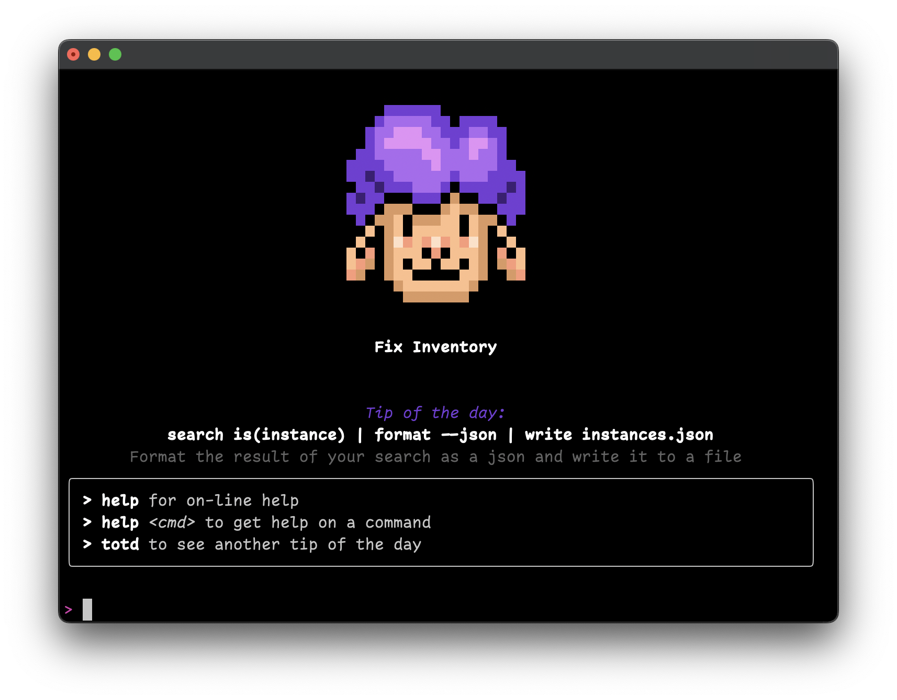

# Launch Fix Inventory

Fix Inventory allows you to manage and explore your cloud infrastructure via a shell interface.

Execute the following to access the [Fix Inventory Shell](../../reference/components/shell.mdx) interface:

```bash
$ docker exec -it fixshell fixsh
```


