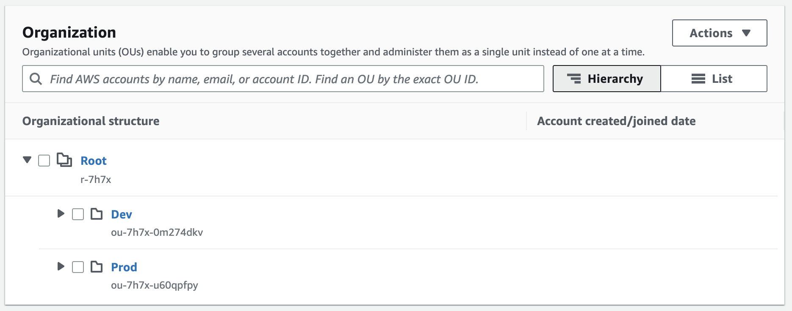
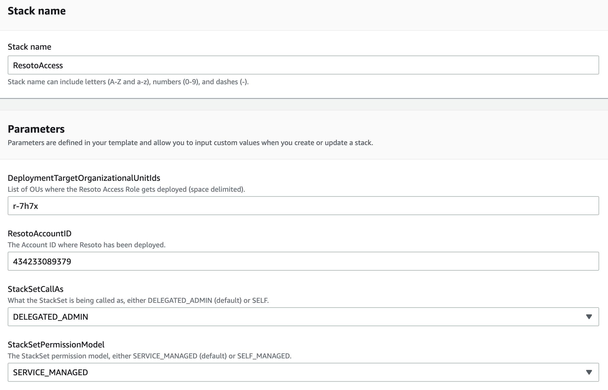
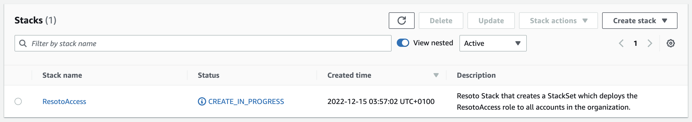
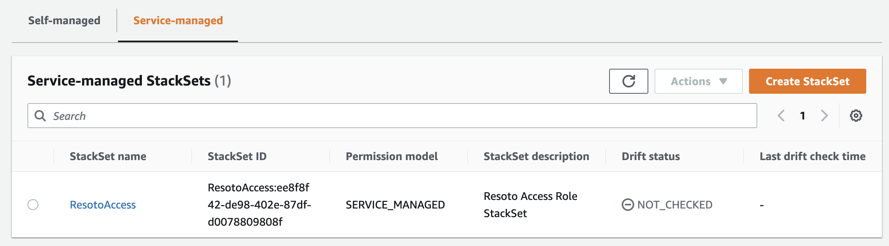
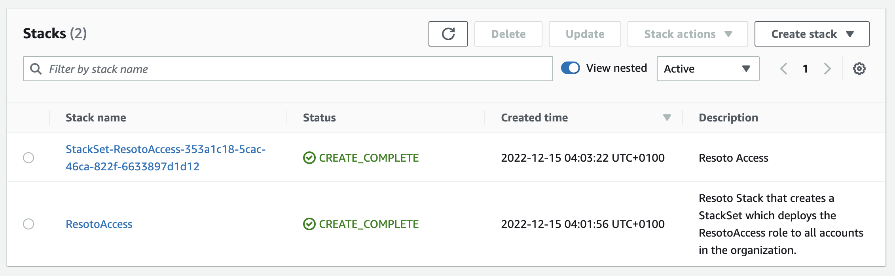
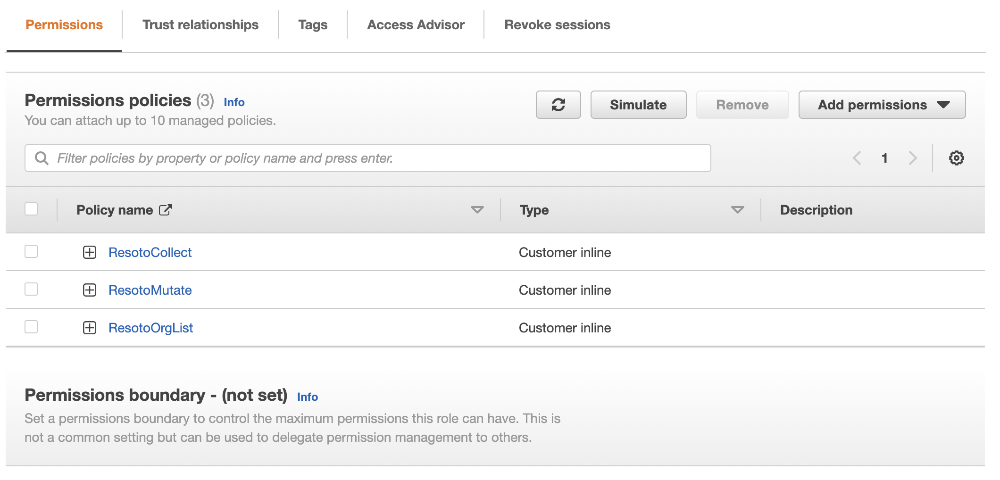
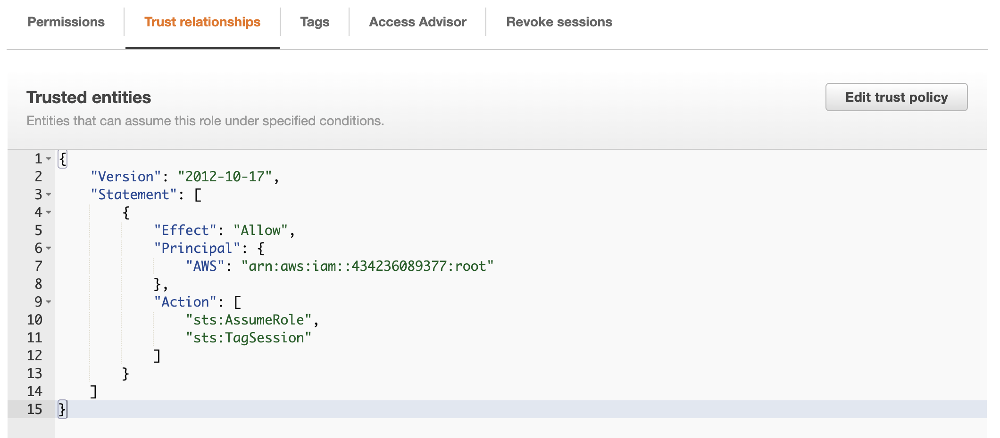

# How to Roll Out Fix Inventory AWS Permissions with CloudFormation

Each version of Fix Inventory programmatically generates the specific <abbr title="Identity and Access Management">IAM</abbr> [permissions](../../../reference/iam-permissions/aws.mdx) it requires to collect (and optionally, manipulate) AWS resources. Manually maintaining these permissions is a tedious task, especially if you have multiple AWS accounts.

**To eliminate this pain point, we provide a CloudFormation template that automatically creates a `FixInventoryAccess` role with the required permissions and a trust that allows a specified AWS account to assume this role.**

The stack can be deployed in a single account, or organization-wide as a [CloudFormation StackSet](https://docs.aws.amazon.com/AWSCloudFormation/latest/UserGuide/what-is-cfnstacksets.html). In this how-to guide, we use this template to create a StackSet that deploys the `FixInventoryAccess` role to all accounts in your organization.

:::info

The source code can be found in the [`someengineering/fixinventory-cf` GitHub repository](https://github.com/someengineering/fixinventory-cf).

:::

## Prerequisites

This guide assumes that you have already [installed](../../../getting-started/install/index.mdx) Fix Inventory.

You also need an [AWS Organization](https://aws.amazon.com/organizations) that meets the [prerequisites for StackSet operations](https://docs.aws.amazon.com/AWSCloudFormation/latest/UserGuide/stacksets-prereqs.html).

## Directions

### Deploying the StackSet

<Tabs>
<TabItem value="console" label="AWS Console">

1. Open the [AWS Organizations Console](https://console.aws.amazon.com/organizations/v2/home/accounts) and find the Organization Unit (OU) where you want to deploy the `FixInventoryAccess` role. The role will be deployed to all accounts in this OU and all child OUs.

   The OU is the cryptic string underneath the <abbr title="Organization Unit">OU</abbr> name. To deploy the role to all accounts in the organization, use the **Root** OU (`r-7h7x` in the below example).

   

2. If you are not already in the correct account, log into the account where you want to deploy the StackSet. This account will be the account that manages the StackSet and the role that is deployed to all accounts in the organization unit.

3. Click this button to open the **Quick create stack** page:

   [<span class="button button--primary">Deploy Stack</span>](https://console.aws.amazon.com/cloudformation/home#/stacks/create)

4. Specify the template by selecting "Upload a template file" and upload the file. Press Next.

5. Enter a stack name (e.g., `FixInventoryAccess`) and configure the four parameters as follows:

   | Parameter | Description |
   | --- | --- |
   | `DeploymentTargetOrganizationalUnitIds` | The <abbr title="Organization Unit">OU</abbr> (or multiple, space-delimited <abbr title="Organization Unit">OU</abbr>s) where you wish to deploy the role. |
   | `FixInventoryAccountID` | The account ID of the account where you have Fix Inventory deployed. This account will be the one the Role has a trust relationship with. |
   | `StackSetCallAs` | Defaults to `DELEGATED_ADMIN` but can be changed to `SELF` depending on the permissions you have in your organization and whether the account you are deploying the StackSet in is registered as a delegated administrator for your organization (recommended). |
   | `StackSetPermissionModel` | Defaults to `SERVICE_MANAGED` but can be changed to `SELF_MANAGED` if you want to manage the StackSet permissions yourself. We prefer `SERVICE_MANAGED` as it allows us to turn on automatic deployments to accounts that we add to our organization in the future. |

   

6. Click **Next** on both this page and the next, then click **Create Stack**.

   The stack will take a few minutes to deploy.

   

7. In the menu to the left, click **StackSets**. You can see that the StackSet is being created on the **Self-managed** or **Service-managed** tab (depending on the option you chose).

   

8. After a few minutes, the StackSet will be created and begin deploying to all accounts in our organization. Reviewing the stacks in `us-east-1`, you should now see a new stack created by the StackSet:

   

   If we click it and check out its resources, you will see the `FixInventoryAccess` <abbr title="Identity and Access Management">IAM</abbr> role:

   

   Selecting the role, you can confirm it has the correct permissions as well as a trust relationship with the account where Fix Inventory is deployed:

   

</TabItem>
<TabItem value="cli" label="AWS CLI">

1. Open the [AWS Organizations Console](https://console.aws.amazon.com/organizations/v2/home/accounts) and find the Organization Unit (OU) where you want to deploy the `FixInventoryAccess` role. The role will be deployed to all accounts in this OU and all child OUs.

   The OU is the cryptic string underneath the <abbr title="Organization Unit">OU</abbr> name. To deploy the role to all accounts in the organization, use the **Root** OU (`r-7h7x` in the below example).

   

2. Execute the following in your terminal, replacing the values of `AWS_OU` and `FIX_ACCOUNT_ID` with your <abbr title="Organization Unit">OU</abbr> and the ID of the account where you have Fix Inventory deployed:

   ```bash
   AWS_OU="r-7h7x"  # Replace with your OU
   FIXINVENTORY_ACCOUNT_ID="434236089377"  # Replace with your Fix Inventory account ID
   aws cloudformation create-stack \
     --region us-east-1 \
     --stack-name FixInventoryAccess \
    --template-body file://path/to/your/fixinventory-role.template \
    --parameters ParameterKey=DeploymentTargetOrganizationalUnitIds,ParameterValue="$AWS_OU" ParameterKey=FixInventoryAccountID,ParameterValue=$FIX_ACCOUNT_ID
   ```

   :::info

   The region can be changed to any region you like, but [<abbr title="Identity and Access Management">IAM</abbr> is a global service running in `us-east-1`](https://docs.aws.amazon.com/IAM/latest/UserGuide/reference_policies_condition-keys.html#condition-keys-requestedregion).

   :::

</TabItem>
</Tabs>

### Configuring Fix Inventory to Assume the `FixInventoryAccess` Role and Scrape the Organization

1. In Fix Inventory Shell, execute `config edit fix.worker` and locate the `aws` section.

2. Modify the configuration as follows:

   ```yaml
   aws:
     role: 'FixInventoryAccess'
     scrape_org: true
     assume_current: true
     do_not_scrape_current: true
   ```

   The `assume_current` and `do_not_scrape_current` options depend on your organization setup. They control whether Fix Inventory should assume the role inside the account it is running in, or just collect that account with the permissions it already has. (For instance, if you deploy Fix Inventory using Kubernetes and it is using a service account that is already using the `FixInventoryAccess` role, there would be no need to assume the same role again.)

## Further Reading

- [AWS Permissions](../../../reference/iam-permissions/aws.mdx)
