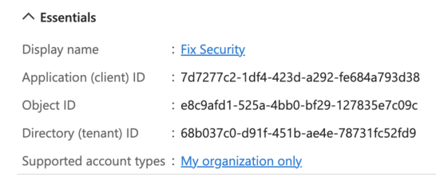
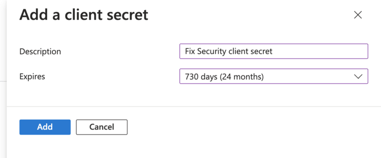
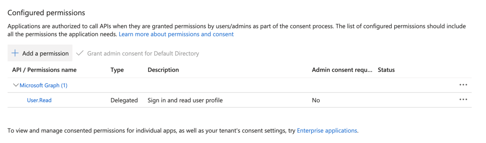
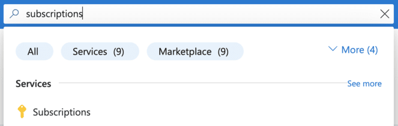
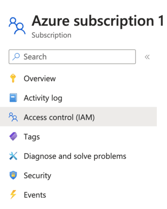
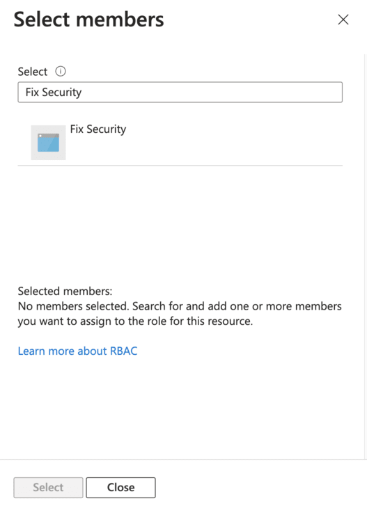

# How to Collect Azure Resource Data

The [Azure](../../../reference/unified-data-model/azure.mdx) collector is configured within the [Fix Inventory Worker configuration](../../../reference/configuration/index.mdx) via the [`config` command](../../../reference/cli/config/index.mdx) in [Fix Inventory Shell](../../../reference/components/shell.mdx).

## Prerequisites

This guide assumes that you have already [installed](../../../getting-started/install/index.mdx) Fix Inventory.

## Directions

### 1. Enable the Azure Collector

1.  Open the [Fix Inventory Worker configuration](../../../reference/configuration/index.mdx) via the [`config` command](../../../reference/cli/config) in [Fix Inventory Shell](../../../reference/components/shell):

    ```bash
    > config edit fix.worker
    ```

2.  Add `azure` to the list of collectors by modifying the configuration as follows:

    ```yaml
    fixworker:
      ...
      # List of collectors to run
      collector:
    # highlight-next-line
        - 'azure'
        ...
    ...
    ```

### 2. Configure Azure

1.  Open the Azure console.

2.  In the search box, type **App registrations** and select the **App registrations** service:

    

3.  Click **New registration**:

    

4.  Enter a name for the application and click the **Register** button:

    

5.  Make note of the displayed **Application (client) ID** and **Directory (tenant) ID**:

    

    :::note

    These values will be provided as `client_id` and `tenant_id` to the Azure collector.

    :::

6.  Click on **Certificates & secrets** in the left-hand menu:

    

7.  Click **New client secret**:

    

8.  Enter a description for the secret, select an expiration period, and click the **Add** button:

    

9.  Make note of the displayed **Value** of the created secret:

    

    :::note

    This value will be provided as `client_secret` to the Azure collector.

    :::

10. Click on **API permissions** in the left-hand menu:

    

11. Click **Add a permission**:

    

12. Click **Azure Service Management**:

    

13. Select the **user_impersonation** permission:

    

14. Click the **Add permissions** button:

    

15. In the search box, type **Subscriptions** and select the **Subscriptions** service:

    

16. Click on your subscription:

    

17. Click **Access control (IAM)** in the left-hand menu:

    

18. Click **Add role assignment**:

    

19. In the **Role** tab, select the **Reader** role:

    

20. Click the **Next** button:

    

21. In the **Members** tab, click **Select members**:

    

22. Search for the application you created earlier:

    

23. Click the application and click the **Select** button:

    

24. Click the **Review + assign** button:

    

### 3. Authenticate with Azure

<Tabs>
<TabItem value="configuration" label="Fix Inventory Worker Configuration">

1.  Open the [Fix Inventory Worker configuration](../../../reference/configuration/index.mdx) via the [`config` command](../../../reference/cli/config) in [Fix Inventory Shell](../../../reference/components/shell):

    ```bash
    > config edit fix.worker
    ```

2.  Modify the `azure` section of the configuration as follows, adding your API tokens and/or access keys:

    ```yaml
    azure:
    # highlight-start
      accounts:
        default:
          client_secret:
            tenant_id: '<tenant ID>'
            client_id: '<client ID>'
            client_secret: '<client secret>'
    # highlight-end
    ```

</TabItem>
<TabItem value="environment" label="Environment Variables">

**Instead of specifying API tokens or secret access keys in the [Fix Inventory Worker configuration](../../../reference/configuration/index.mdx) directly, it is possible to define them using the [`--override` flag or `FIXWORKER_OVERRIDE` environment variable](../../../reference/configuration/index.mdx#overriding-individual-properties).**

1.  Set the `FIXWORKER_OVERRIDE` environment variable:

    - Add a environment variable definition to the `fixworker` service in `docker-compose.yaml`:

      ```yaml title="docker-compose.yaml"
      services:
        ...
        fixworker:
      # highlight-start
          environment:
            - FIXWORKER_OVERRIDE="azure.accounts.default.client_secret.tenant_id=<tenant ID> azure.accounts.default.client_secret.client_id=<client ID> azure.accounts.default.client_secret.client_secret=<client secret>"
      # highlight-end
        ...
      ...
      ```

    - Recreate the `fixworker` container with the updated service definition:

      ```bash
      $ docker-compose up -d
      ```

      :::note

      [Docker Compose V2 integrated compose functions in to the Docker platform.](https://docs.docker.com/compose/#compose-v2-and-the-new-docker-compose-command)

      In Docker Compose V2, the command is `docker compose` (no hyphen) instead of `docker-compose`.

      :::

</TabItem>
</Tabs>

### 4. Trigger Resource Collection

1.  By default, Fix Inventory performs resource collection each hour. To immediately trigger a collect run, use the [`workflow run` command](../../../reference/cli/workflow/run.mdx) in [Fix Inventory Shell](../../../reference/components/shell):

    ```bash
    > workflow run collect
    ```

2.  Once the collect run completes, you can view a summary of collected [Azure resources](../../../reference/unified-data-model/azure.mdx) using the following search:

    ```bash
    > search is(azure_resource) | count kind
    ```
