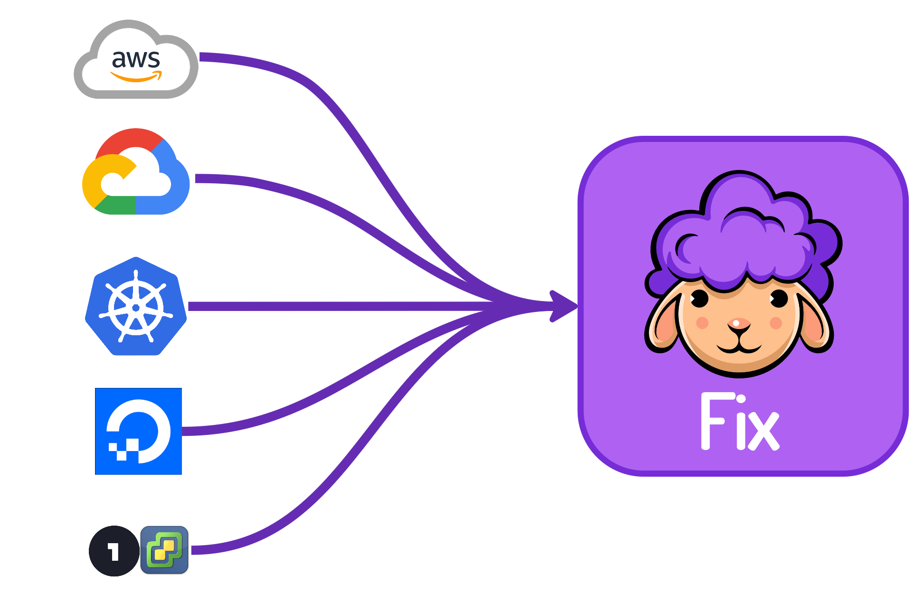
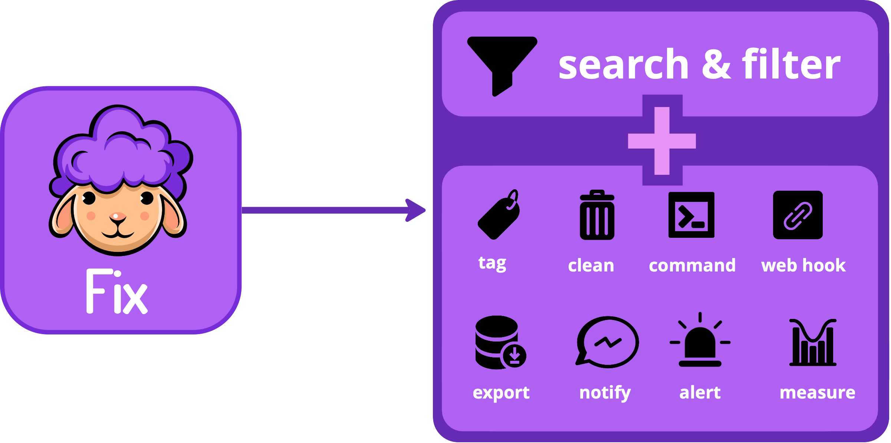

# Overview

**Fix Inventory is an [open-source](https://github.com/someengineering/fixinventory/blob/main/LICENSE) [cloud asset inventory](./concepts/asset-inventory-graph/index.mdx) tool for infrastructure and security engineers.**

Fix Inventory enables a broad set of exploration and [automation](./concepts/automation/index.mdx) scenarios. Its foundation is a [graph-based data model](./concepts/asset-inventory-graph/index.mdx), which exposes resource metadata and [dependency relationships](./concepts/asset-inventory-graph/index.mdx#edges) between your service's assets.

A powerful [CLI](./reference/cli/index.mdx) allows you to [search](./reference/search/index.mdx), explore, and [manage](./concepts/resource-management/index.mdx) your cloud resources.

Fix Inventory's [automations](./concepts/automation/index.mdx) facilitates [resource management](./concepts/resource-management/index.mdx) like [tagging](./concepts/resource-management/tagging.mdx) and [cleanup](./concepts/resource-management/cleanup.mdx) based on custom rules and logic, ensuring that your infrastructure remains organized and optimized.

## Documentation Sections Overview

Fix Inventory's documentation is organized as follows:

- **[Getting Started](./getting-started/index.mdx)** walks you through the installation process. **_Start here if you're new to Fix Inventory._**

- **[How-To Guides](./how-to-guides/index.mdx)** provide step-by-step instructions for performing specific tasks.

- **[Concepts](./concepts/index.mdx)** provide an overview of how Fix Inventory works.

- **[Reference](./reference/index.mdx)** is a manual covering the details of Fix Inventory. It is assumed that you already have a basic understanding of important concepts.

- **[Development](./development/index.mdx)** lists instructions and guidelines for Fix Inventory development and contributions.

:::tip

Don't want to manage your own Fix Inventory installation? Get started for free with **[Fix Security](https://fix.security)**, an all-in-one security dashboard built on top of Fix Inventory.

:::

## Why Cloud Asset Inventory?

Cloud-native infrastructure today is fragmented because:

1. **Resource Proliferation in the Cloud**

   With containers and serverless functions, services have become more abstract, and the size of the individual deliverable has become smaller but many times more numerous.

2. **Bulkhead Partitioning of Resources**

   Cloud providers have made partitioning resources into separate accounts, projects, and namespaces easy. This allows for better isolation and security, but also makes it harder to get a consistent view of the state of the world.

3. **Shared Ownership**

   Engineers using Infrastructure-as-code (IaC) in <abbr title= "continuous integration">CI</abbr>/<abbr title= "continuous deployment">CD</abbr> pipelines make it easy to spin up new resources.

4. **Multiple Service Providers**

   Many organizations use multiple services and cloud providers to take advantage of the unique features of each provider.

**Fix Inventory helps you overcome these challenges by providing a single source of truth for your cloud assets.**

With Fix Inventory, you can [search](./reference/search/index.mdx), explore, and [manage](./concepts/resource-management/index.mdx) your cloud resources in a consistent manner, no matter which cloud provider, account, project, or namespace they are in.

Fix Inventory's complete, up-to-date picture of your infrastructure combined with [automations](./concepts/automation/index.mdx) enable you to easily [manage all of your cloud assets](./concepts/resource-management/index.mdx).

