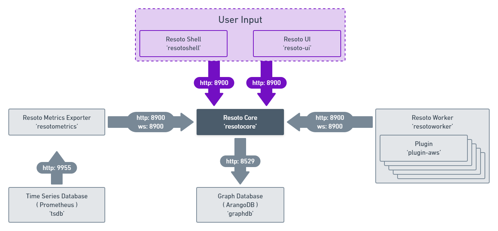

# Components

- [Fix Inventory Core](./core.mdx) maintains all cloud resource metadata in an indexed and searchable [directed multigraph](<https://en.wikipedia.org/wiki/Multigraph#Directed_multigraph_(edges_with_own_identity)>). It can run automated jobs whenever data in the graph changes. A job in turn could create reports, validate resource tags, fix invalid or missing tags, notify users or even clean up resources.
- [Fix Inventory Worker](./worker.mdx) loads cloud collectors and [plugins](./plugins/index.mdx) to perform collect and cleanup operations. It is the component that talks to the cloud provider APIs. It sends collected data to the [Fix Inventory Core](./core.mdx). One or more workers can collect data from multiple cloud providers and accounts.
- [Fix Inventory Shell](./shell.mdx) allows for interactions with Fix Inventory Core and is the main user interface.
- [Fix Inventory Metrics](./metrics.mdx) is a [Prometheus exporter](https://prometheus.io/docs/instrumenting/exporters) that allows exporting of metrics for display on e.g. [Grafana](https://grafana.com) dashboards.

