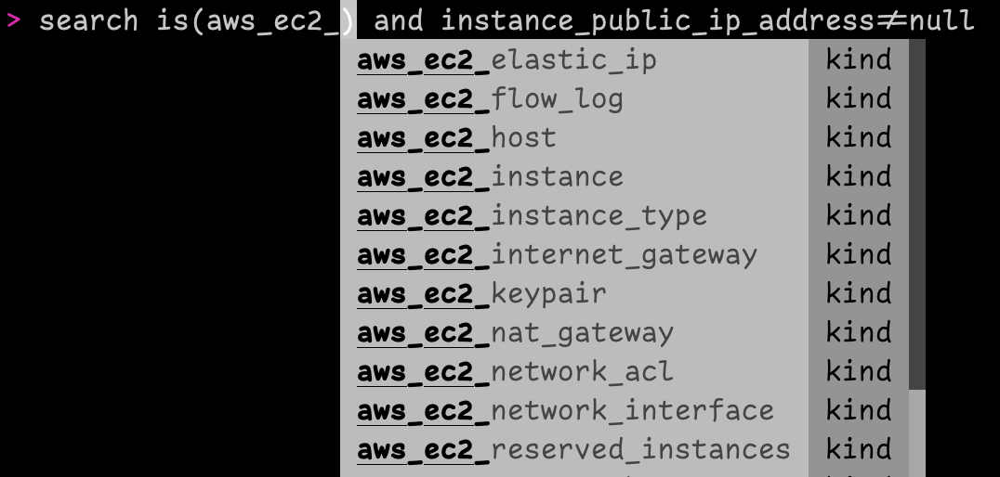

# Explore Fix Inventory

## `help` Command

Use the `help` command to list all available commands, or `help <command name>` to view information about a specific command.

## Tab Completion

Fix Inventory Shell has auto-complete functionality for command and resource kind names, making it much easier to create commands and queries.

## Next Steps

Not sure what to do next? Here are some suggestions:

- **[How-To Guides](../../how-to-guides/index.mdx)** provide step-by-step instructions for performing various tasks within Fix Inventory, such as [search](../../how-to-guides/search/index.mdx), [cleanup](../../how-to-guides/cleanup/index.mdx), [alerting](../../how-to-guides/alerting/index.mdx), and [data export](../../how-to-guides/data-export/index.mdx).
- **[Concepts](../../concepts/index.mdx)** describe key topics and ideas, and provide an overview of how Fix Inventory works.

If you want to stay up to date with the latest Fix Inventory news:

- Watch the [`someengineering/fixinventory` GitHub repository](https://github.com/someengineering/fixinventory) and be the first to know about new features and releases.
- You can get help with Fix Inventory and connect with a growing community of cloud engineers in the [Some Engineering Discord server](https://discord.gg/someengineering).
- Follow [Some Engineering on LinkedIn](https://linkedin.com/company/someengineering) for updates, insights, podcast episodes, sneak peeks, and more!

## Further Reading

- [Command-Line Interface](../../reference/cli/index.mdx)
