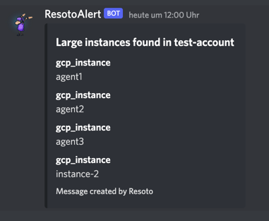

# How to Send Discord Notifications

Fix Inventory constantly monitors your infrastructure, and can alert you to any detected issues.

One way to receive these alerts is via [Discord](https://discord.com). In this guide, we will configure Fix Inventory to send alerts to a Discord text channel.

## Prerequisites

This guide assumes that you have already [installed](../../../getting-started/install/index.mdx) and configured Fix Inventory to [collect your cloud resources](../../../getting-started/configure/index.mdx).

You will also need the **Manage Webhooks** permission for the target text channel in your Discord server.

## Directions

1. [Create a webhook](https://support.discord.com/hc/en-us/articles/228383668-Intro-to-Webhooks) in your Discord server. Be sure to select the channel to which you want Fix Inventory to send alerts.

   :::tip

   Customize the webhook name and avatar to make it easier to distinguish multiple webhooks for different alerts or services.

   :::

2. Install the `discord` [Infrastructure App](../../infrastructure-apps/index.mdx) using the [`app install` command](../../../reference/cli/app/install.mdx):

   ```bash
   > app install discord
   ```

3. Define search criteria for which to trigger an alert. For example, let's say we have an account called `test-account` where instances with more than 4 GB of RAM are not permitted:

   ```bash
   > search is(instance) and instance_memory>4 and /ancestors.account.reported.name==test-account
   ```

4. Pipe the result of the search query to the `discord` app with your desired alert text and Discord webhook URL:

   ```bash
   > search is(instance) and instance_memory>4 and /ancestors.account.reported.name==test-account | discord --title="Large instances found in test-account" --webhook="https://discord.com/api/webhooks/..."
   ```

   If the defined condition is currently true, you should see a new message appear in the specified Discord text channel:

   

   :::tip

   A default webhook URL can be defined in the `discord` app configuration so that you can simply execute `discord --title="..."`:

   ```bash
   > config edit fix.apps.discord
   ```

   :::

5. To automate the alerts, create a [job](../../../concepts/automation/index.mdx#jobs):

   ```bash
   > jobs add --id notify_large_test_instances --wait-for-event post_collect 'search is(instance) and instance_memory>4 and /ancestors.account.reported.name==test-account | discord --title="Large instances found in test-account" --webhook="https://discord.com/api/webhooks/..."'
   ```

## Further Reading

- [Search](../../../reference/search/index.mdx)
- [Automation](../../../concepts/automation/index.mdx)
- [Command-Line Interface](../../../reference/cli/index.mdx)
- [Infrastructure Apps How-To Guides](../../infrastructure-apps/index.mdx)
